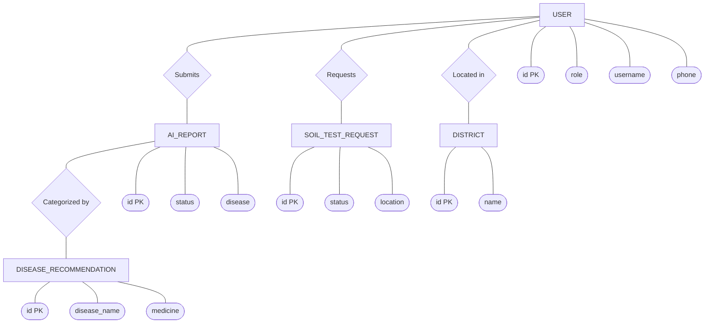
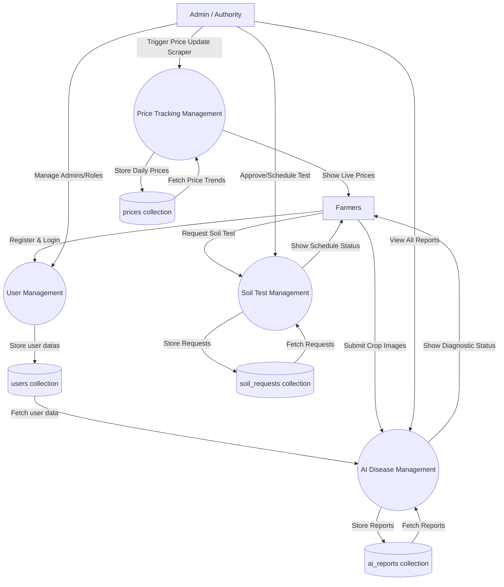

# FarmCare - Comprehensive Project Report

## 1. Project Overview
**FarmCare** is a smart, AI-driven digital platform designed specifically for Cardamom farmers in Kerala. The system leverages artificial intelligence to identify crop diseases, provides real-time market prices, allows for professional soil testing requests, and delivers bilingual support (English and Malayalam) to assist the farming community.

---

## 2. System Modules
Based on the architecture, the system is divided into several interconnected modules:

1. **User Management Module**: Handles registration, authentication, and role management (Farmer, Admin). It maintains user profiles, farm sizes, and location details.
2. **AI Crop Doctor Module (Disease Detection)**: Allows farmers to upload images of cardamom plants. It integrates with Google Gemini AI to analyze the image, detect diseases, and recommend treatments.
3. **Market Price Tracking Module**: Automatically scrapes and stores daily cardamom auction prices across various markets and grades to help farmers track price trends.
4. **Soil Testing Module**: Enables farmers to request professional soil testing. Admins can track, approve, schedule, and complete these requests.
5. **Community & Content Module**: Manages public content such as announcements, team member details, and a community gallery for sharing farm-related media.

---

## 3. Database Tables (Data Dictionary)

### T.1 User Profile
| Field Name | Data Type | Constraints | Description |
| :--- | :--- | :--- | :--- |
| `id` | INT | Primary Key | Unique identifier |
| `user_id` | INT | Foreign Key, Not Null | Links to standard Auth User |
| `role` | VARCHAR(10) | Default 'farmer' | Role: 'farmer' or 'admin' |
| `phone` | VARCHAR(15) | Nullable | Contact number |
| `location` | VARCHAR(200) | Nullable | Village/Address |
| `district_id` | INT | Foreign Key, Nullable | Links to District |
| `farm_size` | DECIMAL(10,2) | Nullable | Farm size in acres |
| `profile_picture` | VARCHAR(100) | Nullable | Path to profile image |
| `bio` | TEXT | Nullable | User biography |
| `created_at` | DATETIME | Not Null | Record creation timestamp |

### T.2 AI Report
| Field Name | Data Type | Constraints | Description |
| :--- | :--- | :--- | :--- |
| `id` | INT | Primary Key | Unique identifier |
| `farmer_id` | INT | Foreign Key, Not Null | Links to the requesting user |
| `image` | VARCHAR(100) | Not Null | Uploaded plant image path |
| `status` | VARCHAR(20) | Default 'pending' | Processing status |
| `disease_detected` | VARCHAR(200) | Nullable | Name of identified disease |
| `confidence_level` | VARCHAR(50) | Nullable | AI confidence percentage |
| `severity` | VARCHAR(50) | Nullable | Disease severity |
| `recommendation_id` | INT | Foreign Key, Nullable | Linked established recommendation |
| `gemini_response` | TEXT | Nullable | Raw AI analysis result |
| `created_at` | DATETIME | Not Null | Date and time requested |

### T.3 Soil Test Request
| Field Name | Data Type | Constraints | Description |
| :--- | :--- | :--- | :--- |
| `id` | INT | Primary Key | Unique identifier |
| `farmer_id` | INT | Foreign Key, Not Null | Links to the requesting user |
| `farm_location` | VARCHAR(300) | Not Null | Specific location for test |
| `farm_size` | DECIMAL(10,2) | Not Null | Size of the farm |
| `status` | VARCHAR(20) | Default 'pending' | Request status |
| `scheduled_date` | DATE | Nullable | Date scheduled for test |
| `requested_at` | DATETIME | Not Null | Date of request creation |

### T.4 Cardamom Price
| Field Name | Data Type | Constraints | Description |
| :--- | :--- | :--- | :--- |
| `id` | INT | Primary Key | Unique identifier |
| `market` | VARCHAR(200) | Not Null | Name of the market |
| `grade` | VARCHAR(20) | Default 'other' | Cardamom grade (8mm, 7mm, etc) |
| `modal_price` | DECIMAL(10,2) | Nullable | Average/Modal price |
| `date` | DATE | Not Null | Date of price record |
| `scraped_at` | DATETIME | Not Null | Timestamp of scrape operation |

### T.5 Disease Recommendation
| Field Name | Data Type | Constraints | Description |
| :--- | :--- | :--- | :--- |
| `id` | INT | Primary Key | Unique identifier |
| `disease_name` | VARCHAR(200) | Unique, Not Null | Name of the disease |
| `description` | TEXT | Not Null | Disease overview |
| `symptoms` | TEXT | Not Null | Common symptoms |
| `medicine` | TEXT | Not Null | Recommended chemical/organic medicine |
| `severity` | VARCHAR(20) | Default 'medium' | General severity level |

---

## 4. Entity-Relationship (ER) Diagram (Reference Style)

Based on the provided reference style, this is a Chen-style ER Diagram with explicit Entities (Rectangles), Attributes (Ovals), and Relationships (Diamonds).

---

## 5. Data Flow Diagrams (DFD)

### Comprehensive System DFD
Created to match the exact visual structure from your reference DFD image (using circles for processes, rectangles for users, and cylinders for collections).

